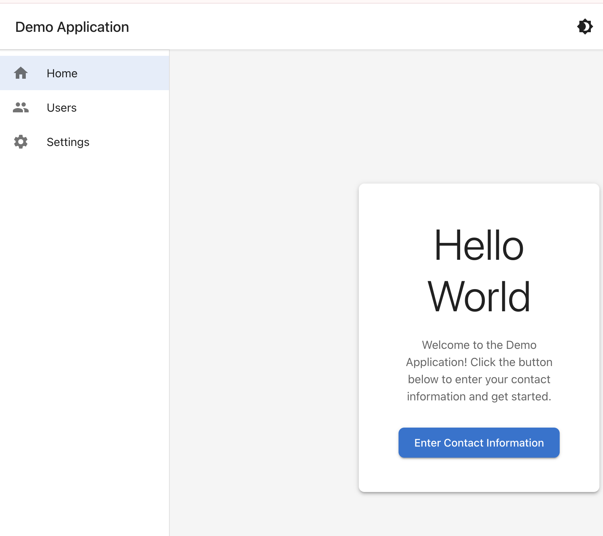

# Demo React Application

> **See [INSTRUCTIONS.md](./INSTRUCTIONS.md) for the original project requirements and specifications.**

A modern React 19 application built with TypeScript, featuring a semi-micro-frontend architecture with Material UI components, dark/light theme support, and AG Grid compatibility.

**Generated with:** Claude Sonnet 4.5 (Model: `claude-sonnet-4-5-20250929`)

### Generation Stats
- **Total cost:** $3.04
- **API duration:** 15m 33s
- **Wall time:** 1h 31m 33s
- **Code changes:** 1,816 lines added, 4 lines removed
- **Model usage:**
  - Claude Haiku: 28.1k input, 1.2k output ($0.0340)
  - Claude Sonnet: 667 input, 61.9k output, 3.7m cache read, 257.8k cache write ($3.01)

## Screenshot



## Features

- **React 19** with TypeScript and hooks-only (no classes)
- **Material UI (MUI) v6** for UI components
- **Collapsible sidebar** navigation with top header
- **Dark/Light theme** toggle with persistent preference
- **Contact form modal** with validation
- **User management** page displaying registered users
- **Monorepo structure** with shared UI package
- **Vite** for fast development and builds
- **React Router DOM** for navigation

## Project Structure

```
demo/
├── packages/
│   ├── shared-ui/          # Shared components, theme, hooks, and utilities
│   │   ├── src/
│   │   │   ├── components/  # Reusable components (AppLayout, Sidebar, TopBar, Modal)
│   │   │   ├── theme/       # Theme configuration for MUI and AG Grid
│   │   │   ├── hooks/       # Custom React hooks (useLocalStorage)
│   │   │   └── utils/       # Utility functions (validation)
│   │   └── package.json
│   │
│   └── main-app/           # Main React application
│       ├── src/
│       │   ├── components/  # App-specific components
│       │   ├── pages/       # Page components (Home, Users, Settings)
│       │   ├── contexts/    # React Context providers
│       │   └── App.tsx
│       └── package.json
└── package.json            # Root workspace configuration
```

## Prerequisites

### Installing Node.js and npm

**On macOS:**

**Option 1: Using Homebrew (recommended)**
```bash
# Install Homebrew if you don't have it
/bin/bash -c "$(curl -fsSL https://raw.githubusercontent.com/Homebrew/install/HEAD/install.sh)"

# Install Node.js (includes npm)
brew install node
```

**Option 2: Download from nodejs.org**
1. Go to https://nodejs.org/
2. Download the LTS version
3. Run the installer

**Verify installation:**
```bash
node --version   # Should show v20.x.x or higher
npm --version    # Should show v10.x.x or higher
```

## Getting Started

### 1. Install Dependencies

```bash
cd /Users/vishshalit/claude-repos/demo
npm install
```

This will install all dependencies for both the shared-ui package and the main-app.

### 2. Start Development Server

```bash
npm run dev
```

The application will open automatically at http://localhost:5173

### 3. Build for Production

```bash
npm run build
```

This builds both packages. The main-app build output will be in `packages/main-app/dist/`.

### 4. Preview Production Build

```bash
npm run preview
```

## Usage

### Home Page
- Click the "Enter Contact Information" button to open the contact form modal
- Fill in the required fields (Name and Email)
- Optionally add Phone and Company information
- Submit the form to save the user

### Users Page
- View all registered users in a table
- See Name, Email, Phone, Company, and sign-up date for each user

### Theme Toggle
- Click the sun/moon icon in the top-right corner to toggle between light and dark themes
- Theme preference is saved automatically

## Development Workflow

### Working on Shared UI Package

The shared-ui package contains reusable components that can be used across multiple applications.

```bash
cd packages/shared-ui
# Make changes to components, theme, hooks, or utilities
# Changes are automatically reflected in main-app via npm workspaces
```

### Adding New Components

1. Create component in `packages/shared-ui/src/components/`
2. Export it in `packages/shared-ui/src/components/index.ts`
3. Import in main-app: `import { YourComponent } from '@demo/shared-ui'`

### Creating Additional Micro-Frontends

1. Create new package in `packages/` directory
2. Add to root `package.json` workspaces array
3. Import shared-ui components: `import { AppLayout } from '@demo/shared-ui'`
4. Can be deployed independently

## Technology Stack

- **React 19** - UI library
- **TypeScript** - Type safety
- **Vite** - Build tool and dev server
- **Material UI v6** - Component library
- **Emotion** - CSS-in-JS (comes with MUI)
- **React Router DOM v6** - Client-side routing
- **npm workspaces** - Monorepo management

## Theme System

The application includes a comprehensive theming system that supports:

- **Material UI** theme customization
- **AG Grid** compatible CSS variables (for future integration)
- **AG Charts** compatible theme objects (for future integration)
- Persistent theme preference using localStorage

### Using the Theme in Custom Components

```typescript
import { useTheme } from '@demo/shared-ui';

const MyComponent = () => {
  const { mode, toggleTheme } = useTheme();
  // mode is either 'light' or 'dark'
  // toggleTheme() switches between themes
};
```

## Scripts

- `npm run dev` - Start development server
- `npm run build` - Build both packages for production
- `npm run preview` - Preview production build
- `npm run clean` - Remove all node_modules and dist folders

## Future Enhancements

- **AG Grid Integration** - Add advanced data grid to Users page
- **AG Charts Integration** - Add analytics dashboard with charts
- **Module Federation** - Enable runtime micro-frontend integration
- **Backend API** - Replace frontend state with real API calls
- **Authentication** - Add login/logout functionality
- **Form Library** - Integrate React Hook Form for complex forms
- **Testing** - Add Vitest and React Testing Library
- **Storybook** - Component documentation and playground
- **CI/CD** - Automated builds and deployments

## Publishing Shared UI Package

To publish the shared-ui package to npm:

```bash
cd packages/shared-ui
# Update version in package.json
npm publish
```

Other teams can then install it:

```bash
npm install @demo/shared-ui
```

## Troubleshooting

### Port Already in Use

If port 5173 is already in use:
```bash
# Kill the process using the port
lsof -ti:5173 | xargs kill -9

# Or change the port in packages/main-app/vite.config.ts
```

### TypeScript Errors

```bash
# Type check without building
npm run type-check --workspace=@demo/main-app
npm run type-check --workspace=@demo/shared-ui
```

### Clear Cache and Reinstall

```bash
npm run clean
npm install
```

## License

MIT
